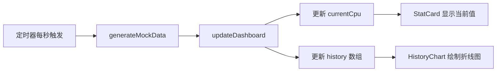

# `MyBlogs` 前端应用技术分析文档

## 📋 文档信息

| 项目               | 内容                  |
| ------------------ | --------------------- |
| **文档版本** | v1.0                  |
| **分析日期** | 2026-04-25            |
| **项目名称** | MyBlogs Frontend App  |
| **源码目录** | `frontend/app/src/` |

---

## 一、项目概述

本项目是一个**实时数据监控看板 (Real-Time Dashboard)** 的前端应用，用于实时展示和监测系统指标（如 CPU 使用率等），包含数值卡片展示和历史趋势图表等功能模块。

---

## 二、技术栈总览

| 类别               | 技术名称              | 版本     | 用途                       |
| ------------------ | --------------------- | -------- | -------------------------- |
| **框架**     | React                 | ^19.2.5  | 用户界面构建               |
| **语言**     | TypeScript            | ~6.0.2   | 类型安全的 JavaScript 超集 |
| **构建工具** | Vite                  | ^8.0.10  | 前端开发与构建服务器       |
| **动画**     | Framer Motion         | ^12.38.0 | 数值切换动画               |
| **图表**     | Recharts              | ^3.8.1   | 历史趋势折线图             |
| **CSS**      | 原生 CSS (层叠样式表) | —       | 组件样式                   |

---

## 三、项目文件结构

```
frontend/app/
├── index.html                          # HTML 入口
├── package.json                        # 依赖与脚本
├── tsconfig.json                       # TypeScript 配置（引用）
├── tsconfig.app.json                   # 应用 TypeScript 配置
├── tsconfig.node.json                  # Node 端 TypeScript 配置
├── vite.config.ts                      # Vite 配置
├── eslint.config.js                    # ESLint 配置
├── README.md                           # 项目说明
└── src/
    ├── main.tsx                        # React 入口（渲染根组件）
    ├── App.tsx                         # 根组件
    ├── App.css                         # App 默认样式（Vite 模板遗留）
    ├── index.css                       # 全局基础样式（Vite 模板遗留）
    └── components/
    │   ├── RealTimeDashboard.tsx        # 核心：实时看板组件
    │   ├── StatCard.tsx                 # 统计卡片组件
    │   ├── HistoryChart.tsx             # 历史趋势折线图组件
    │   └── Dashboard.css               # 看板专用样式
    └── types/
        └── dashboard.ts                # TypeScript 类型定义
```

---

## 四、各文件详细分析

### 4.1 入口文件

#### `index.html` — HTML 入口

```html
<div id="root"></div>
<script type="module" src="/src/main.tsx"></script>
```

- SPA 单页应用入口，定义 `#root` 挂载点
- 加载 `main.tsx` 作为 ES Module 入口

#### `main.tsx` — React 应用启动入口

```tsx
createRoot(document.getElementById('root')!).render(
  <StrictMode>
    <App />
  </StrictMode>,
);
```

- 使用 React 19 的 `createRoot` API 渲染根组件
- 包裹 `<StrictMode>` 启用严格模式（开发环境下双重渲染以检测副作用）

#### `App.tsx` — 根组件

```tsx
function App() {
  return <RealTimeDashboard />;
}
```

- 极简结构，直接渲染 `RealTimeDashboard` 作为唯一页面
- 单页面设计，无路由系统

---

### 4.2 类型定义

#### `types/dashboard.ts` — 核心类型定义

| 接口名                | 字段                  | 说明               |
| --------------------- | --------------------- | ------------------ |
| `DataPoint`         | `cpu: number`       | CPU 使用率 (0-100) |
|                       | `timestamp: number` | Unix 毫秒时间戳    |
| `StatCardProps`     | `title: string`     | 卡片标题           |
|                       | `value: number`     | 展示数值           |
|                       | `unit: string`      | 数值单位           |
|                       | `color: string`     | 左边框颜色         |
| `HistoryChartProps` | `data: DataPoint[]` | 历史数据数组       |

---

### 4.3 核心组件

#### `RealTimeDashboard.tsx` — 实时看板（核心容器组件）

**职责**：作为整个仪表盘的状态管理中心和数据调度器。

**核心逻辑**：



**关键特性**：

1. **mock 数据生成**（`generateMockData`）

   - 基于上一值做 ±5 范围内随机波动
   - 边界限制在 [0, 100] 区间
   - 保留一位小数
2. **数据更新**（`updateDashboard` — 使用 `useCallback`）

   - 更新当前 CPU 值
   - 追加到历史数组，并**保留最近 10 条**记录（滑动窗口）
   - `useCallback` 确保函数引用稳定，避免子组件不必要重渲染
3. **模拟实时推送**（`useEffect` + `setInterval`）

   - 每秒生成一条新数据
   - 清理函数 `clearInterval` 防止内存泄漏
4. **WebSocket 预留**

   - 代码中注释了 WebSocket 接入示例，可替换 mock 逻辑实现真实数据源

**UI 结构**：

```
┌─────────────────────────────────┐
│  📊 实时订单监控看板            │
├─────────────────────────────────┤
│  ┌──────────┐                   │
│  │  销售数据 │  ← StatCard      │
│  │   45.2    │                  │
│  └──────────┘                   │
│  ┌─────────────────────────┐    │
│  │   销量 (折线图)          │    │
│  │   📈                     │  ← HistoryChart
│  └─────────────────────────┘    │
└─────────────────────────────────┘
```

---

#### `StatCard.tsx` — 统计卡片组件

**类型**：展示型 + 纯组件 (`React.memo`)

**Props**：

| 参数      | 类型       | 说明       |
| --------- | ---------- | ---------- |
| `title` | `string` | 卡片标题   |
| `value` | `number` | 展示数值   |
| `unit`  | `string` | 单位       |
| `color` | `string` | 左边框颜色 |

**核心特性**：

1. **React.memo 性能优化**：仅当 props 变化时重新渲染
2. **Framer Motion 入场动画**：数值更新时，新数字从上方淡入滑落
   - `initial`: 半透明 + 上偏移 10px
   - `animate`: 不透明 + 原位
   - `transition`: 0.3s 缓动
3. **动态左边框颜色**：通过 `style={{ borderLeftColor: color }}` 实现个性化标识

---

#### `HistoryChart.tsx` — 历史趋势折线图组件

**类型**：展示型 + 纯组件 (`React.memo`)

**核心特性**：

1. **Recharts 折线图渲染**

   - `<ResponsiveContainer>` 实现响应式宽度
   - `<CartesianGrid>` 添加背景网格线
   - `<Line>` 配置圆滑曲线 (`type="monotone"`)
   - 圆点标记 (`dot={{ r: 3 }}`)
   - 300ms 动画时长
2. **时间格式化**（`useMemo`）

   - 将 Unix 时间戳转为 `HH:mm:ss` 格式（不含小时，只显示分秒）
   - `useMemo` 避免每次渲染都重新格式化
3. **Y 轴固定范围**：`domain={[0, 100]}` 保证视觉一致性

---

### 4.4 样式文件

#### `Dashboard.css` — 看板专用样式

| 选择器               | 作用                                                                                      |
| -------------------- | ----------------------------------------------------------------------------------------- |
| `.dashboard`       | 整体布局容器，浅灰背景，全屏高度                                                          |
| `.cards-grid`      | 卡片网格布局，`grid-template-columns: repeat(auto-fill, minmax(240px, 1fr))` 自适应列数 |
| `.stat-card`       | 圆角白色卡片，左边框 5px 彩色，悬停上浮阴影效果                                           |
| `.stat-title`      | 标题：小字号、大写、浅灰                                                                  |
| `.stat-value`      | 数值：大号 2.8rem、粗体、flex 对齐                                                        |
| `.stat-unit`       | 单位：小字号、浅灰                                                                        |
| `.chart-container` | 图表容器，白色圆角卡片                                                                    |

**交互反馈**：卡片悬停时 `translateY(-2px)` + 阴影加深，提升操作感。

#### `index.css` / `App.css` — Vite 模板遗留样式

- 定义了 CSS 变量（颜色、字体、阴影等）
- 支持 **`prefers-color-scheme: dark`** 暗色模式自动切换
- 包含 Vite 默认模板的 Logo 展示等样式
- 当前实际看板已通过 `Dashboard.css` 覆盖了大部分展示样式

---

### 4.5 工程配置

#### `vite.config.ts` — Vite 构建配置

```ts
export default defineConfig({
  plugins: [react()],                // React 插件（HMR、JSX 支持）
  resolve: { alias: { '@': '/src' } }, // 路径别名 @ 指向 /src
  server: {
    proxy: {
      '/ws': {                       // WebSocket 代理
        target: 'ws://localhost:8080',
        ws: true,
      }
    }
  }
});
```

关键配置点：

- 使用 `@` 别名简化导入路径
- 配置 `/ws` 路径代理到 `ws://localhost:8080`，支持后续 WebSocket 连接

#### `tsconfig.app.json` — TypeScript 配置

| 选项                 | 值                                         | 说明              |
| -------------------- | ------------------------------------------ | ----------------- |
| `target`           | `es2023`                                 | 编译目标          |
| `lib`              | `["ES2023", "DOM"]`                      | 标准库            |
| `module`           | `esnext`                                 | 模块系统          |
| `jsx`              | `react-jsx`                              | 支持 JSX 语法     |
| `moduleResolution` | `bundler`                                | Vite bundler 模式 |
| `strict` 相关      | `noUnusedLocals`, `noUnusedParameters` | 严格 lint 检查    |
| `types`            | `["vite/client"]`                        | Vite 类型支持     |

#### `package.json` — 依赖与脚本

**依赖**：

| 包名                      | 作用                  |
| ------------------------- | --------------------- |
| `react` / `react-dom` | React 核心 + DOM 渲染 |
| `framer-motion`         | 动画效果              |
| `recharts`              | 图表渲染              |

**开发依赖**：

| 包名                                    | 作用            |
| --------------------------------------- | --------------- |
| `typescript`                          | TypeScript 编译 |
| `vite`                                | 构建工具        |
| `@vitejs/plugin-react`                | Vite React 插件 |
| `@types/react` / `@types/react-dom` | React 类型定义  |
| `eslint` / 相关插件                   | 代码规范检查    |

**脚本**：

| 命令                | 说明           |
| ------------------- | -------------- |
| `npm run dev`     | 启动开发服务器 |
| `npm run build`   | 生产构建       |
| `npm run preview` | 预览构建产物   |
| `npm run lint`    | 代码检查       |

---

## 五、已实现功能清单

| 功能分类      | 功能名称           | 状态 | 说明                                |
| ------------- | ------------------ | ---- | ----------------------------------- |
| 🖥️ 数据显示 | 数值展示卡片       | ✅   | StatCard 组件，支持标题、数值、单位 |
| 🎨 视觉效果   | 数值变化动画       | ✅   | Framer Motion 淡入下滑动画          |
| 🎨 视觉效果   | 卡片悬停效果       | ✅   | 上浮 + 阴影加深                     |
| 🎨 视觉效果   | 动态颜色标识       | ✅   | 不同卡片不同左边框颜色              |
| 📈 数据可视化 | 历史趋势折线图     | ✅   | Recharts 折线图，保留最近 10 条数据 |
| ⏱️ 实时数据 | 定时模拟推送       | ✅   | 每秒自动生成新数据                  |
| 🔌 实时数据   | WebSocket 接入预留 | ⏳   | 代码已注释示例，待启用              |
| 🌓 响应式     | 卡片自适应网格     | ✅   | CSS Grid `auto-fill` + `minmax` |
| 🌓 响应式     | 图表自适应宽度     | ✅   | ResponsiveContainer                 |
| 🎨 主题适配   | 暗色模式           | ⏳   | CSS 变量已定义，但 Dashboard 未使用 |
| ⚡ 性能优化   | React.memo         | ✅   | StatCard 和 HistoryChart 均已使用   |
| ⚡ 性能优化   | useCallback        | ✅   | updateDashboard 函数稳定引用        |
| ⚡ 性能优化   | useMemo            | ✅   | 时间格式化缓存                      |
| 🧹 代码规范   | ESLint 配置        | ✅   | 包含 React Hooks 检查               |
| 🧹 代码规范   | TypeScript strict  | ✅   | 严格模式类型检查                    |

---

## 六、数据流架构

```
                    ┌─────────────────────┐
                    │   setInterval 1s    │
                    │  (或 WebSocket)     │
                    └────────┬────────────┘
                             │
                             ▼
           ┌─────────────────────────────────┐
           │    generateMockData(prevCpu)    │
           │   → DataPoint { cpu, timestamp } │
           └───────────────┬─────────────────┘
                           │
                           ▼
           ┌─────────────────────────────────┐
           │     updateDashboard(cpu, ts)    │
           │         (useCallback)           │
           └───────────────┬─────────────────┘
                           │
            ┌──────────────┼──────────────┐
            ▼              ▼              ▼
     ┌──────────┐   ┌──────────┐   ┌──────────────┐
     │currentCpu│   │ history  │   │  清理 (slice) │
     │  (state) │   │ (state)  │   │保留最近10条   │
     └────┬─────┘   └────┬─────┘   └──────────────┘
          │              │
          ▼              ▼
     ┌──────────┐   ┌──────────────┐
     │ StatCard │   │ HistoryChart │
     │ 数值展示  │   │   折线图     │
     │ + 动画   │   │ 响应式渲染   │
     └──────────┘   └──────────────┘
```

---

## 七、总体评估

**优势**：

1. ✅ **组件拆分合理**：按职责分为容器组件 (RealTimeDashboard) 和展示组件 (StatCard, HistoryChart)
2. ✅ **性能优化到位**：React.memo + useCallback + useMemo 三层优化
3. ✅ **类型安全**：完整 TypeScript 类型定义
4. ✅ **考虑扩展性**：预留了 WebSocket 接入点，代理配置已就绪

**可优化方向**：

1. 🔄 当前展示的"销售数据"实际绑定了 CPU 值，数据语义与展示名称不完全匹配，可调整数据模型
2. 🔄 StatCard 的 `value` 缺少千分位格式化，大数值时可读性更好
3. 🔄 暗色模式支持：CSS 变量已定义但 Dashboard 样式未使用变量
4. 🔄 缺少加载状态与错误处理边界

---
